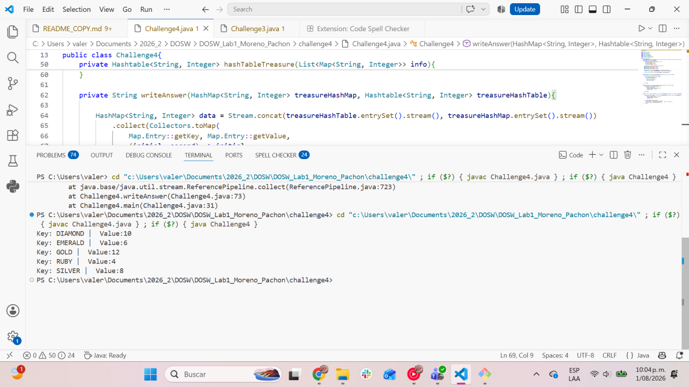
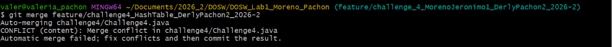
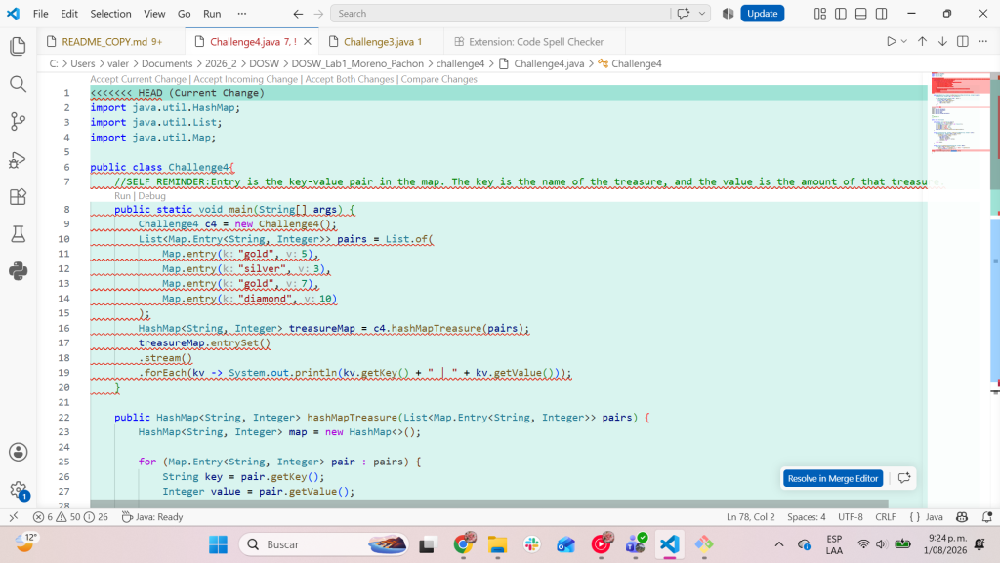
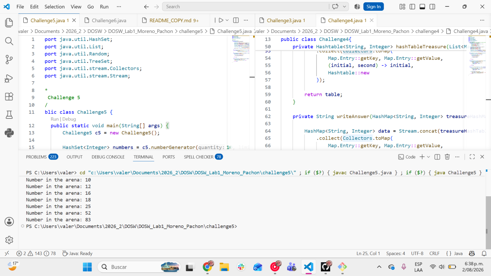
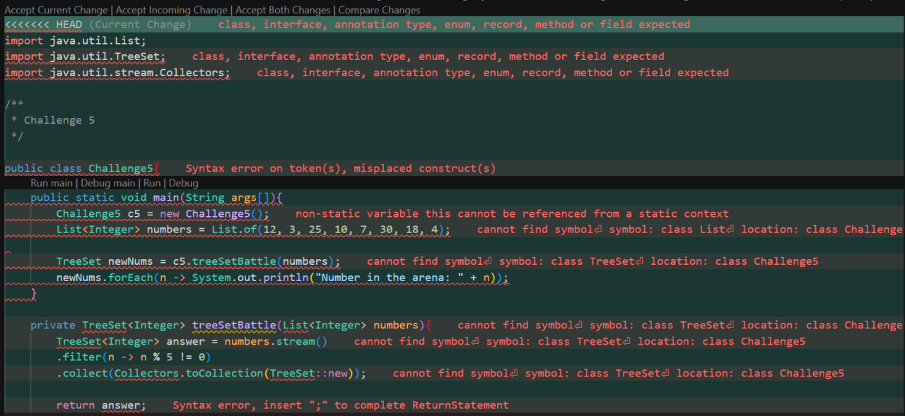
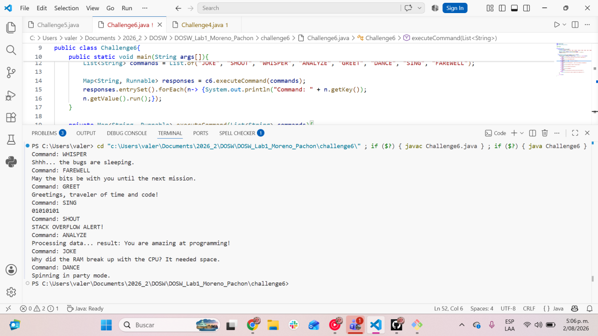
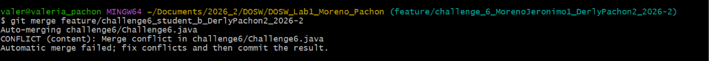
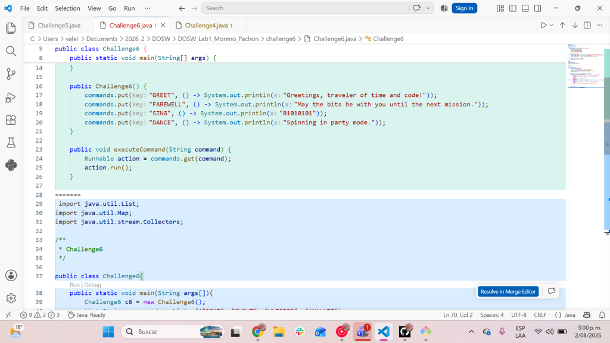
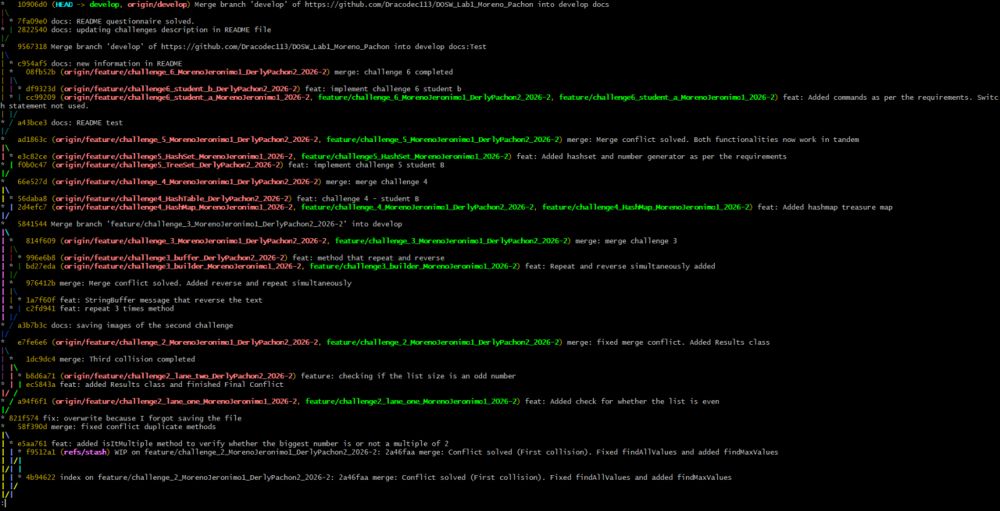

# DOSW_Lab1_Moreno_Pachon

| Name | Institutional Email | GitHub Username |
|---|---|---|
| Student 1 | Jeronimo Moreno Herrera | Dracodec113 |
| Student 2 | Derly Valeria Pachón Pinzón | itsValePp |

## Part 1 — Repository Setup and Preparation

### 1. GitHub Account

We created our GitHub accounts. Next you will find the emails linked with our profiles:

| Name | GitHub account email |
|---|---|
| Jeronimo Moreno Herrera | Dracodec113 |
| Derly Valeria Pachón Pinzón | itsValePp |

### 2. Repository Creation

We show the repository creation above

### 3. Add Collaborators

We include the professors profile and the other students profile to the repository

### 4. Configure Git Locally

Each of us configure Git with its own information

1. `Jeronimo Moreno:`
   
   

2. `Derly Pachón:`
   
   
   

### 5. Create the Development Branch

We created the development branch from the main branch as shown next

### 6. Clone the Repository

Each of us clone the repository in our machines

1. `Jeronimo Moreno:`
   
   

2. `Derly Pachón:`
   
   

### 7. Create Individual Feature Branches

Above we show how each of us  created our own branches

1. `Jeronimo Moreno:`
   
   

2. `Derly Pachón:`
   
   

### 8. Initial Project Structure

Now we will show the project structure according to the laboratory requirements. We may say that we omit the `Laboratory1` folder because we seek avoiding unnecessary or redundant directories.

Finally we made the first `commit` and `push` the initial structure using the given git commands

## Part 2 — Express Hackathon

### Challenge 1 — Welcome Message

#### Evidence

#### Description

Briefly explain:

- What was implemented.  
We implemented a <u> lambda expression </u> known as `functional interface`. Also we used streams to map and collect the required attributes

- How the work was divided.  
We split the work in equal halves. While Derly worked on the streams operations, Jeronimo developed the lambda expressions. 

- Which Git operations were used. 
    - git add .
    - git push -u <branch name>
    - git merge
    - git branch
    - git checkout
  
- Which conflicts appeared.  
In this exercise we didn't have conflicts.

### Challenge 2 — Parallel Commit Race

#### Evidence

#### Description

Briefly explain:

- What was implemented.   
We implemented the principal class `ParcellRace` and a class named `Result` with a unique function that receives two lists of Integers and returns a list that includes (for each list) the maximum value, the minimum value, the number of elements in the list, whether the maximum is a multiple or divisor of 2 and whether the list size is even or odd.

- How the work was divided.  
Jeronimo worked with *lane one* while Derly worked with *lane two*. Each of us developed the mandatory challenges according to the laboratory instructions.  
Like both of us wanted to learn how to solve the conflicts, Jeronimo solved the first collision and Derly the third one, because we have troubles while working in the second collision because we missed saving the file while coding and the we worked on the principal branch of the challenge.

- Which Git operations were used.  
    - git add .
    - git push -u <branch name>
    - git merge
    - git branch
    - git checkout
    - git pull
    - git stash (to save temporarily our changes in a kind of heap)
    - git stash pop (to clear the heap)

- Which conflicts appeared.  
We expected three conflicts as we code separately in three different tasks. However we got just two, because we had troubles while working in the second activity of the challenge by working on the principal branch, so there was no conflicts.  
Next, we will present the conflicts that we had:

Both conflicts were caused because we tried to `merge` with different versions of the code. This means that we tried to update the code having as a base an old version, cause a team mate had already made modifications that we didn't update in our local repository.

- How the conflicts were resolved.  
The first conflict was resolved by deleting an unnecessary part of the code, in order to join correctly both of the functions requested.  
There was no needed to resolve a second conflict as we worked directly on the challenge 2 branch, so it didn't existed any incoherence.  
For the third collision it was needed to add a method and reorganize the main method to generalize the information.  

### Challenge 3 — The Mysterious Echo

#### Evidence

#### Description

Briefly explain:

- What was implemented.  
We implemented a class named `Challenge3` wich contains the four next methods:  
  *  `main`: principal method that create an instance of the class and make the call to the methods that solve the problem.
  *  `reverseText`: method that uses a *StringBuffer* to reverse a given text.
  *  `repeatString`: method that uses a *StringBuilder* to repeat a given text $n$ needed times.
  *  `repeatReverseString`: method that initially repeats a string $n$ times separating with a blank space. Then it reverse the whole string.

- How the work was divided.  
While Jeronimo worked with the repetition problem using a StringBuilder, Derly solve the reverse requirement using a StringBuffer. Later, we make pair-programming in order to solve the conflict.

- Which Git operations were used.  
    - git add .
    - git push -u <branch name>
    - git merge
    - git branch
    - git checkout
    - git pull

- Which conflicts appeared.  
Like we worked in different tasks and created different functions, when we tried to merge our particular challenge branches with the principal challenge branch it was produced a conflict.  

- How the conflicts were resolved.  
We solved the conflict by joining the methods that each one developed, unifying the main method and creating a new method that integrate the separated methods to give a consolidated answer, as the evidence shows.  

### Challenge 4 — The Treasure of Duplicate Keys

#### Evidence

#### Description

Briefly explain:

- What was implemented.  
We implemented a class named `Challenge4` in which we made a mixed use of the properties of a *HashMap* and of a *Hashtable*, trough the use of streams and lambda expressions. This in order to create a *String* that contains the information of the gems in the mandatory order and prioritizing the *Hashtable* values.  
In summary, the objective was to generate a final String with the information in the corresponding format from using a concatenated stream formed by the streams of a Hashtable and a HashMap. We placed first the Hashtable information through the concatenation, in order to prioritize it values.

- How the work was divided.  
While Jeronimo creates map one using a HashMap, Derly created map two using a Hashtable. Then both of us contribute to the construction of the conflict solution and the requirements fulfillment.

- Which Git operations were used.  
    - git add .
    - git push -u <branch name>
    - git merge
    - git branch
    - git checkout
    - git pull
    - git stash (to save temporarily our changes in a kind of heap)

- Which conflicts appeared.  
We had one conflict when we tried to merge our individual challenge branches with the main challenge branches, because each had different code in our local repositories.  

- How the conflicts were resolved.  
To solve the conflict we created a new method that constructed a String with the information from the Hashtable and the HasMap (through the methods previously developed before the conflict). To achieve our goal we used streams and used the collector `joining` to add a jump line next of each element.  

### Challenge 5 — Battle of Sets

#### Evidence

#### Description

Briefly explain:

- What was implemented.  
We implemented a class named `Challenge5` that creates a set starting from a a HashSet and a TreeSet. We:
   - Remove duplicates through the set properties
   - Avoid the corresponding multiples using `.filter(n -> ...)`
   - Print the final values using a lambda expression like `.forEach()` 
Is important to identify that we used different methods to manipulate each type of set and one method to combine the sets in one and unify the answer.

- How the work was divided.  
While Jeronimo worked with the HashSet and filter the multiples of 3, Derly worked with a TreeSet and filter the multiples of 5. We worked together to solve the conflict.

- Which Git operations were used.  
    - git add .
    - git push -u <branch name>
    - git merge
    - git branch
    - git checkout
    - git pull

- Which conflicts appeared.  
There was a conflict when we tried to merge both individual branches into the main challenge branch, because each of us had different content in our java files.

- How the conflicts were resolved.  
We solved the conflict by adding a new method that relate the particular methods that each of us developed and we delete some redundant information in the main method to consolidate the solution.

### Challenge 6 — The Decision Machine

#### Evidence

#### Description

Briefly explain:

- What was implemented.  
We implemented a class named `Challenge6` in which we have the next methods:
   - `main`: principal method that creates a instance of the class, create the list of possible commands and print the solution using lambda expressions (.forEach())
   - `executedCommand`: method that return a Map where the keys are Strings and the the values are Runnable. We created the map using streams, .toMap() collector and a switch to decide which message was going to be added according to the command in the key.

- How the work was divided.  
While Jeronimo created the map with the student a commands ("GREET", "DANCE", "SING", "FAREWELL"), Derly worked creating the map with the student b commands ("JOKE", "SHOUT", "WHISPER", "ANALYZE"). At the end, we worked together to solve the conflict by unifying both command sets.

- Which Git operations were used.  
    - git add .
    - git push -u <branch name>
    - git merge
    - git branch
    - git checkout
    - git pull

- Which conflicts appeared.  
When we tried to merge the challenge secondary branches with the main challenge branch we had a conflict caused by different versions. This because each of us had a different group of commands and a particular coding style.  

- How the conflicts were resolved.  
We solved the conflict by unifying the groups of commands with its corresponding responses and by defining one style and structure for the solution strategy.  

## Part 3 — Conceptual Questionnaire

1. Team agreements: Add the agreements you defined in the Onboarding section here.

   - What times will you meet?  
      We would like to meet three times during the week with the next objectives:  
      1. Stablish working dinamics, defining roles (lane 1, lane 2, student a, student b), creating and structuring the repository and working in the first two challenges.
      2. Solving conflicts, developing the next two challenges and organizing the README file.
      3. Solving the last two challenges, solving the questionnaire and finishing all the documentation tasks.
  
   - What will your communication channels be: Teams, WhatsApp, Slack...?  
      We will communicate through WhatsApp and Discord.

   - How often will you meet?  
      We will work on monday, saturday and sunday.

   - If a conflict were to arise, how could you resolve it?  
      We could try to solve it by our one, analyzing both codes and creating a strategy to merge them properly. If we don´t understand something about the others development, we can ask our mate through a message in any of the communication channels predefined.

2. What is the difference between git merge and git rebase?

   A merge basically "combines" the histories of both branches through commits, while a rebase rewrites the history of the other branch replaying the commits on top of the branch.

3. What happens when two branches modify the same line of a file?

   Nothing happens unless we merge them onto a common branch. When those two are merged onto a common branch a conflict emerges and one must resolve it.

4. How can you display the branch and merge history graphically in the terminal?

   Using the command `git log --oneline --graph --decorate --all`

5. What is the difference between a commit and a push?

   A commit is a change made on your local machine yet to be uploaded to the remote repo, once we push that commit it gets uploaded to the remote repo.

6. What are git stash and git stash pop used for?

   git stash is used to save yet to be commited changes so you can work on other stuff. Once you want to work on those stashed changes you would use stash pop to take them off the stash and restart working on them.

7. What is the difference between HashMap and Hashtable?
   
   Hashmap allows null keys and null values. It's not synchronized.
   Hashtable is a legacy class that doesn't allow null keys nor values. It's synchronized.

8. What advantages does Collectors.toMap() provide over a traditional loop?

   It allows us to make multiple moves at once. Instead of needing to create an empty map and populate it through a loop, we can directly use a stream to create our map. This also synergises well with other stream methods such as filter.

9.  When using stream().map() on a list of objects, what type of operation is being performed?

   It applies a function to each element of the stream and produces a new stream of transformed elements, without modifying the original list.

10. What does stream().filter() do, and what does it return?

   filter() compares values against a condition, then the values that pass the condition are returned in the form of a stream.

11. Describe the steps required to create a new feature branch from develop.

   First we need to have our develop branch so we create it `git checkout -b develop`.
   Then while having that branch active we create our new feature branch using the same command `git checkout -b feature/...`.
   Finally to upload it to the remote repository we use `git push -u origin feature/...`.

12. What is the difference between git branch and git checkout -b?

   `git branch` can create a branch, but it doesn't directly moves you to that branch, while `git checkout` does move you to the newly created branch.

13. Why should new functionality be developed in feature/* branches instead of directly in main?

   Because while working with multiple team members we can run into repeated conflicts. Having multiple feature branches allows cooperative work with multiple people and easier conflict resolution. Apart from that, the `main` branch usually represents the stable version of our project, thus having untested code on this branch is a bad practice.

> **Note:**
> We finally would like to add a bigger piece of the repository historical  
> 