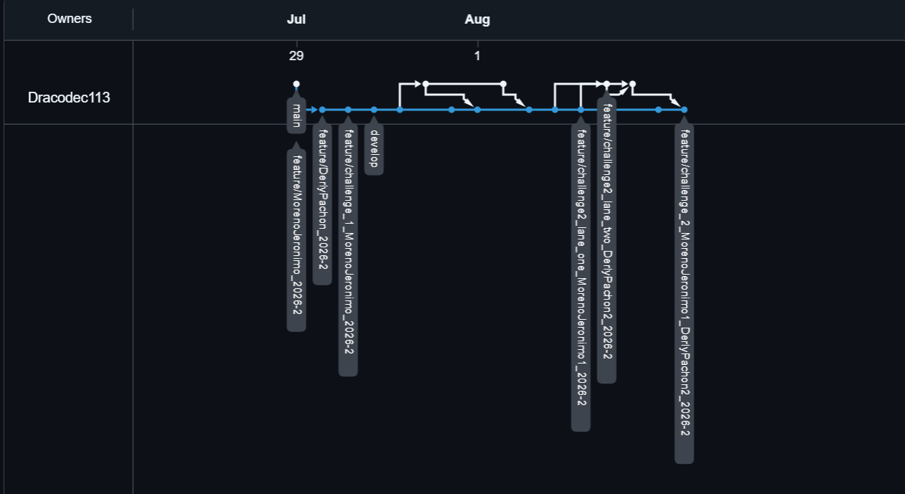
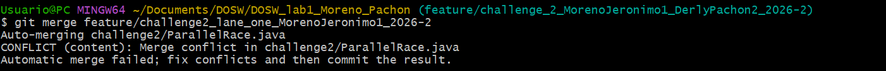
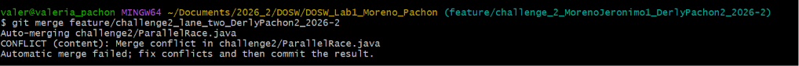
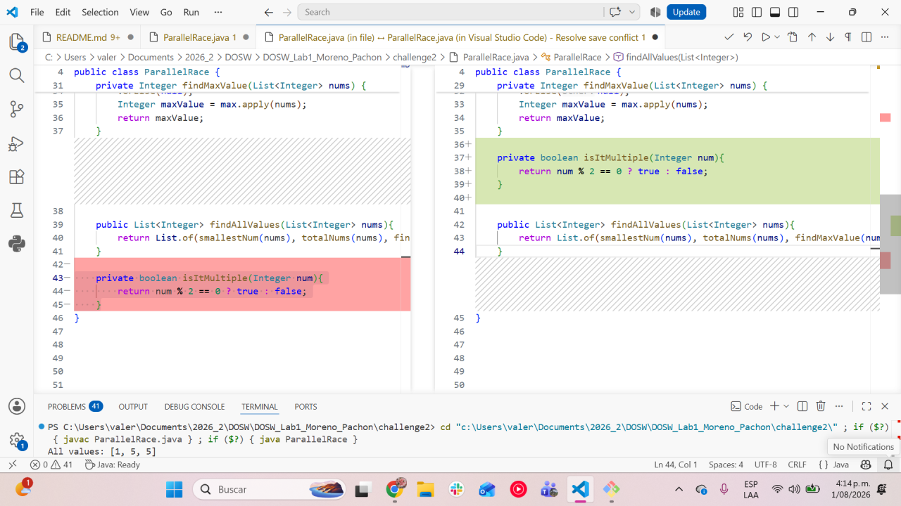
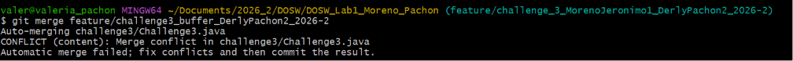
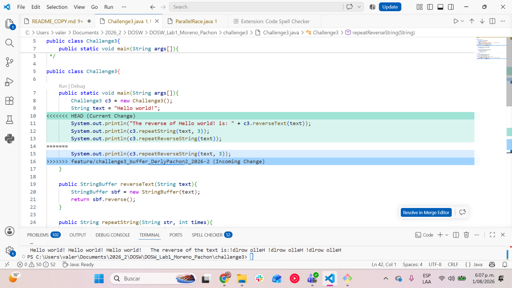

# DOSW_Lab1_Moreno_Pachon

| Name | Institutional Email | GitHub Username |
|---|---|---|
| Student 1 | Jeronimo Moreno Herrera | Dracodec113 |
| Student 2 | Derly Valeria Pachón Pinzón | itsValePp |

## Part 1 — Repository Setup and Preparation

### 1. GitHub Account

We created our GitHub accounts. Next you will find the emails linked with our profiles:

| Name | GitHub account email |
|---|---|
| Jeronimo Moreno Herrera | Dracodec113 |
| Derly Valeria Pachón Pinzón | itsValePp |

### 2. Repository Creation

We show the repository creation above

### 3. Add Collaborators

We include the professors profile and the other students profile to the repository

### 4. Configure Git Locally

Each of us configure Git with its own information

1. `Jeronimo Moreno:`
   
   

2. `Derly Pachón:`
   
   
   

### 5. Create the Development Branch

We created the development branch from the main branch as shown next

### 6. Clone the Repository

Each of us clone the repository in our machines

1. `Jeronimo Moreno:`
   
   

2. `Derly Pachón:`
   
   

### 7. Create Individual Feature Branches

Above we show how each of us  created our own branches

1. `Jeronimo Moreno:`
   
   

2. `Derly Pachón:`
   
   

### 8. Initial Project Structure

Now we will show the project structure according to the laboratory requirements. We may say that we omit the `Laboratory1` folder because we seek avoiding unnecessary or redundant directories.

Finally we made the first `commit` and `push` the initial structure using the given git commands

## Part 2 — Express Hackathon

### Challenge 1 — Welcome Message

#### Evidence

#### Description

Briefly explain:

- What was implemented.  
We implemented a <u> lambda expression </u> known as `functional interface`. Also we used streams to map and collect the required attributes

- How the work was divided.  
We split the work in equal halves. While Derly worked on the streams operations, Jeronimo developed the lambda expressions. 

- Which Git operations were used. 
    - git add .
    - git push -u <branch name>
    - git merge
    - git branch
    - git checkout
  
- Which conflicts appeared.  
In this exercise we didn't have conflicts.

### Challenge 2 — Parallel Commit Race

#### Evidence

#### Description

Briefly explain:

- What was implemented.   
We implemented the principal class `ParcellRace` and a class named `Result` with a unique function that receives two lists of Integers and returns a list that includes (for each list) the maximum value, the minimum value, the number of elements in the list, whether the maximum is a multiple or divisor of 2 and whether the list size is even or odd.

- How the work was divided.  
Jeronimo worked with *lane one* while Derly worked with *lane two*. Each of us developed the mandatory challenges according to the laboratory instructions.  
Like both of us wanted to learn how to solve the conflicts, Jeronimo solved the first collision and Derly the third one, because we have troubles while working in the second collision because we missed saving the file while coding and the we worked on the principal branch of the challenge.

- Which Git operations were used.  
    - git add .
    - git push -u <branch name>
    - git merge
    - git branch
    - git checkout
    - git stash (to save temporarily our changes in a kind of heap)
    - git stash pop (to clear the heap)

- Which conflicts appeared.  
We expected three conflicts as we code separately in three different tasks. However we got just two, because we had troubles while working in the second activity of the challenge by working on the principal branch, so there was no conflicts.  
Next, we will present the conflicts that we had:

Both conflicts were caused because we tried to `merge` with different versions of the code. This means that we tried to update the code having as a base an old version, cause a team mate had already made modifications that we didn't update in our local repository.

- How the conflicts were resolved.  
The first conflict was resolved by deleting an unnecessary part of the code, in order to join correctly both of the functions requested.  
There was no needed to resolve a second conflict as we worked directly on the challenge 2 branch, so it didn't existed any incoherence.  
For the third collision it was needed to add a method and reorganize the main method to generalize the information.  

### Challenge 3 — The Mysterious Echo

#### Evidence

#### Description

Briefly explain:

- What was implemented.
We implemented a 

- How the work was divided.  
- Which Git operations were used.  
- Which conflicts appeared.  
  
- How the conflicts were resolved.  
- 

### Challenge 4 — The Treasure of Duplicate Keys

#### Evidence

#### Description

Briefly explain:

- What was implemented.
- How the work was divided.
- Which Git operations were used.
- Which conflicts appeared.
- How the conflicts were resolved.  

### Challenge 5 — Battle of Sets

#### Evidence

#### Description

Briefly explain:

- What was implemented.
- How the work was divided.
- Which Git operations were used.
- Which conflicts appeared.
- How the conflicts were resolved.

### Challenge 6 — The Decision Machine

#### Evidence

#### Description

Briefly explain:

- What was implemented.
- How the work was divided.
- Which Git operations were used.
- Which conflicts appeared.
- How the conflicts were resolved.

## Part 3 — Conceptual Questionnaire

1. Team agreements: Add the agreements you defined in the Onboarding section here.

2. What is the difference between git merge and git rebase?

   A merge basically "combines" the histories of both branches through commits, while a rebase rewrites the history of the other branch replaying the commits on top of the branch.

3. What happens when two branches modify the same line of a file?

   Nothing happens unless we merge them onto a common branch. When those two are merged onto a common branch a conflict emerges and one must resolve it.

4. How can you display the branch and merge history graphically in the terminal?

   Using the command `git log --oneline --graph --decorate --all`

5. What is the difference between a commit and a push?

   A commit is a change made on your local machine yet to be uploaded to the remote repo, once we push that commit it gets uploaded to the remote repo.

6. What are git stash and git stash pop used for?

   git stash is used to save yet to be commited changes so you can work on other stuff. Once you want to work on those stashed changes you would use stash pop to take them off the stash and restart working on them.

7. What is the difference between HashMap and Hashtable?
   
   Hashmap allows null keys and null values. It's not synchronized.
   Hashtable is a legacy class that doesn't allow null keys nor values. It's synchronized.

8. What advantages does Collectors.toMap() provide over a traditional loop?

   It allows us to make multiple moves at once. Instead of needing to create an empty map and populate it through a loop, we can directly use a stream to create our map. This also synergises well with other stream methods such as filter.

9. When using stream().map() on a list of objects, what type of operation is being performed?

   It applies a function to each element of the stream and produces a new stream of transformed elements, without modifying the original list.

10. What does stream().filter() do, and what does it return?

   filter() compares values against a condition, then the values that pass the condition are returned in the form of a stream.

11. Describe the steps required to create a new feature branch from develop.

   First we need to have our develop branch so we create it `git checkout -b develop`.
   Then while having that branch active we create our new feature branch using the same command `git checkout -b feature/...`.
   Finally to upload it to the remote repository we use `git push -u origin feature/...`.

12. What is the difference between git branch and git checkout -b?

   `git branch` can create a branch, but it doesn't directly moves you to that branch, while `git checkout` does move you to the newly created branch.

13. Why should new functionality be developed in feature/* branches instead of directly in main?

   Because while working with multiple team members we can run into repeated conflicts. Having multiple feature branches allows cooperative work with multiple people and easier conflict resolution. Apart from that, the `main` branch usually represents the stable version of our project, thus having untested code on this branch is a bad practice.