# DOSW_Lab1_Moreno_Pachon

    >> DOSW Lab 01: Git, GitHub and functional programming
    >> Team members: Jeronimo Moreno Herrera and Derly Valeria Pachón Pinzón

## Part 1 — Repository Setup and Preparation

### 1. GitHub Account

We created our GitHub acounts. Next you will find the emails linked with our profiles:

    - jeronimo.moreno-h@mail.escuelaing.edu.co
    - dv.pachonpinzon@gmail.com

### 2. Repository Creation

We show the repository creation above

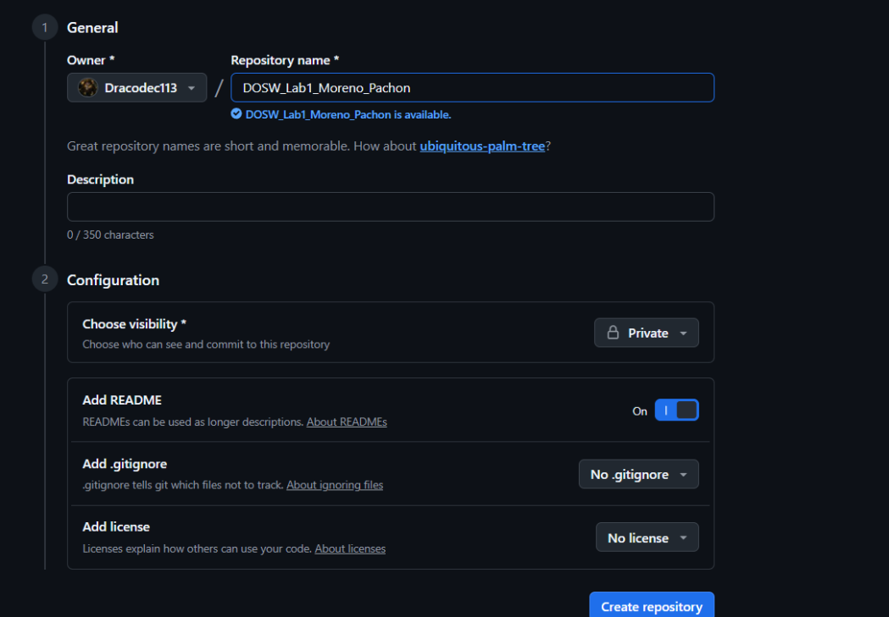
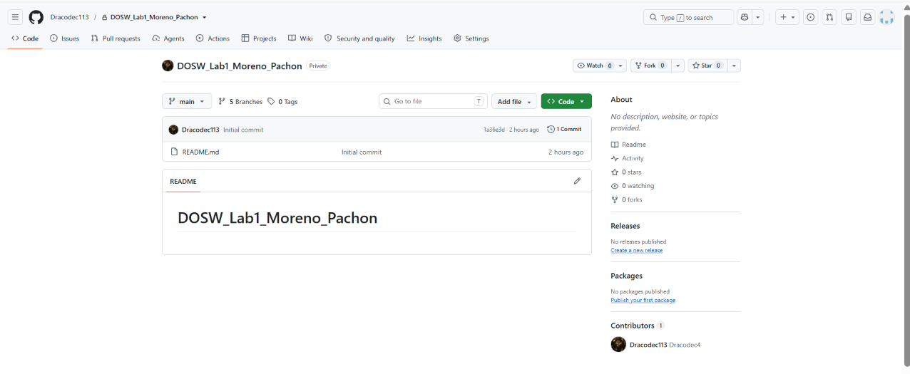

### 3. Add Collaborators

We include the professors profile and the other students profile to the repository

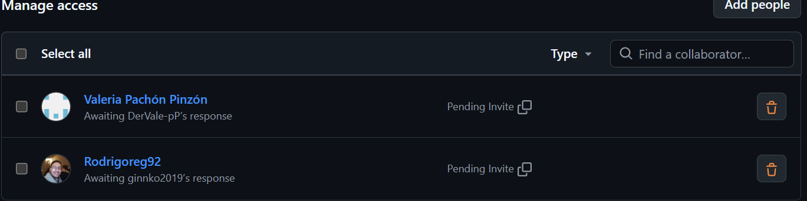

### 4. Configure Git Locally

Each of us configure Git with its own information

1. `Jeronimo Moreno:`
   
   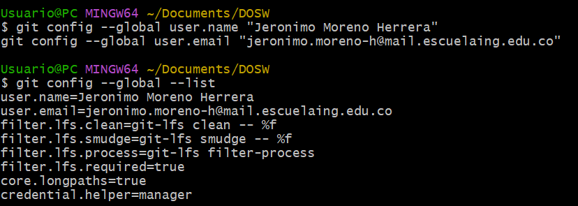

2. `Derly Pachón:`
   
   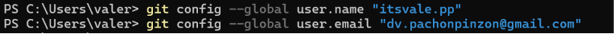
   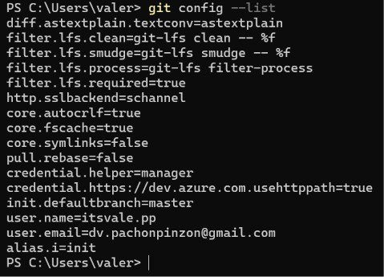

### 5. Create the Development Branch

We created the development branch from the main branch as shown next

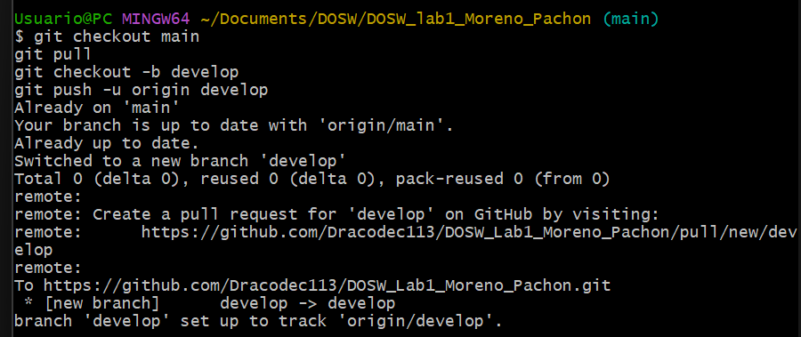

### 6. Clone the Repository

Each of us clone the repository in our machines

1. `Jeronimo Moreno:`
   
   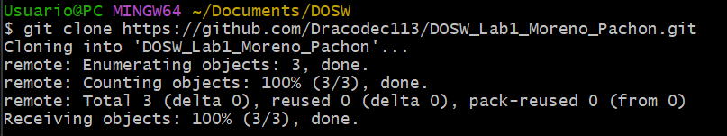

2. `Derly Pachón:`
   
   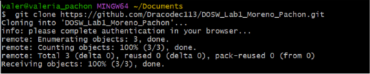

### 7. Create Individual Feature Branches

Above we show how each of us  created our own branch

1. `Jeronimo Moreno:`
   
   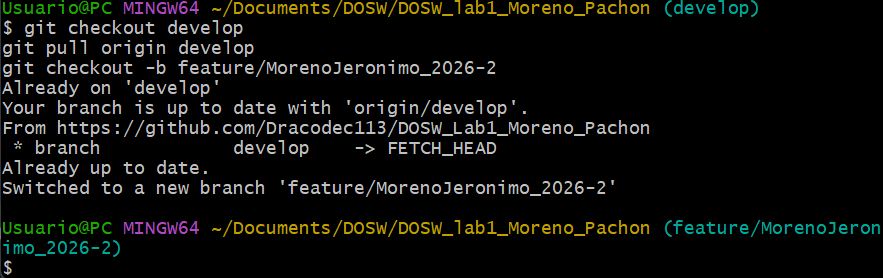

2. `Derly Pachón:`
   
   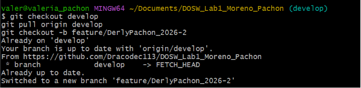

### 8. Initial Project Structure

Now we will show the project structure acoording to the laboratory requirements

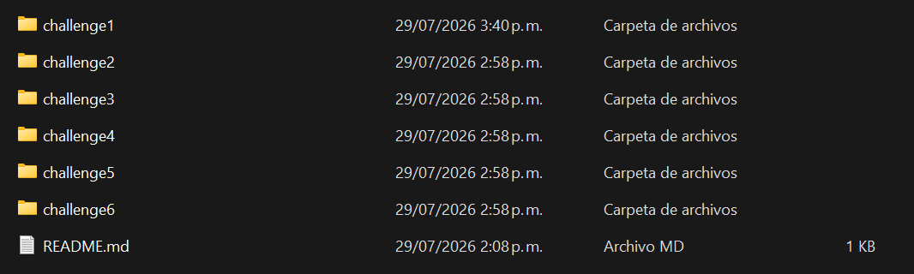

Finally we made the first `commit` and `push` the initial structure using the given git commands

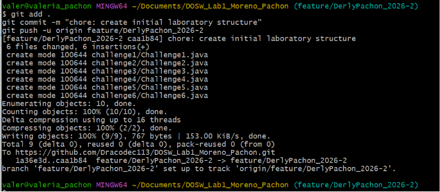

## Part 2 — Express Hackathon

### Challenge 1 — Welcome Message

#### Evidence

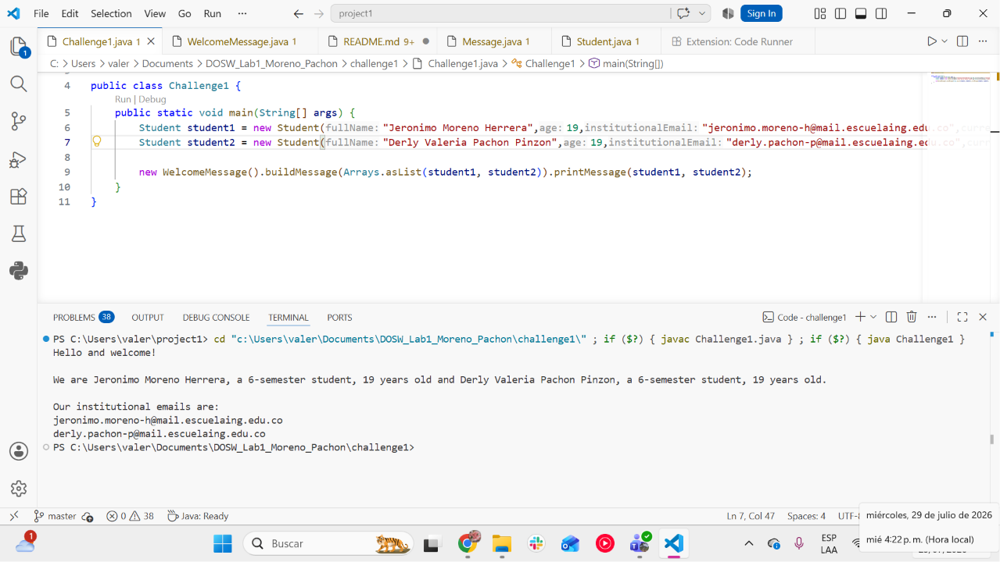

#### Description

Briefly explain:

- What was implemented.  
We implemented a <u> lambda expression </u> known as `functional interface`. Also we used streams to map and collect the required attributes

- How the work was divided.  
We split the work in equal halves. While Derly worked on the streams operations, Jeronimo developed the lambda expressions. 

- Which Git operations were used. 
    - git add .
    - git push -u <branch name>
    - git merge
    - git branch
    - git checkout
  
- Which conflicts appeared.  
In this exercise we didn't have conflicts.

### Challenge 2 — Parallel Commit Race

#### Evidence

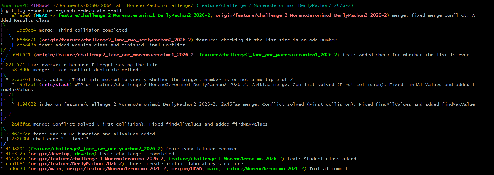

#### Description

Briefly explain:

- What was implemented.
- How the work was divided.
- Which Git operations were used.
- Which conflicts appeared.
- How the conflicts were resolved.

### Challenge 3 — The Mysterious Echo

#### Evidence

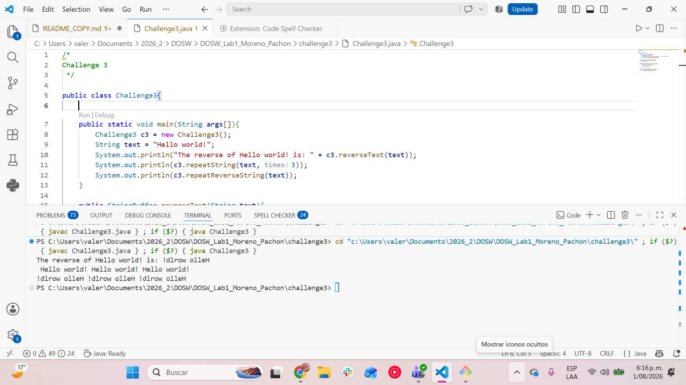

#### Description

Briefly explain:

- What was implemented.
- How the work was divided.
- Which Git operations were used.
- Which conflicts appeared.
- How the conflicts were resolved.

### Challenge 4 — The Treasure of Duplicate Keys

#### Evidence

#### Description

Briefly explain:

- What was implemented.
- How the work was divided.
- Which Git operations were used.
- Which conflicts appeared.
- How the conflicts were resolved.

### Challenge 5 — Battle of Sets

#### Evidence

#### Description

Briefly explain:

- What was implemented.
- How the work was divided.
- Which Git operations were used.
- Which conflicts appeared.
- How the conflicts were resolved.

### Challenge 6 — The Decision Machine

#### Evidence

#### Description

Briefly explain:

- What was implemented.
- How the work was divided.
- Which Git operations were used.
- Which conflicts appeared.
- How the conflicts were resolved.

## Part 3 — Conceptual Questionnaire

1. Team agreements: Add the agreements you defined in the Onboarding section here.

2. What is the difference between git merge and git rebase?

   A merge basically "combines" the histories of both branches through commits, while a rebase rewrites the history of the other branch replaying the commits on top of the branch.

3. What happens when two branches modify the same line of a file?

   Nothing happens unless we merge them onto a common branch. When those two are merged onto a common branch a conflict emerges and one must resolve it.

4. How can you display the branch and merge history graphically in the terminal?

   Using the command `git log --oneline --graph --decorate --all`

5. What is the difference between a commit and a push?

   A commit is a change made on your local machine yet to be uploaded to the remote repo, once we push that commit it gets uploaded to the remote repo.

6. What are git stash and git stash pop used for?

   git stash is used to save yet to be commited changes so you can work on other stuff. Once you want to work on those stashed changes you would use stash pop to take them off the stash and restart working on them.

7. What is the difference between HashMap and Hashtable?
   
8. What advantages does Collectors.toMap() provide over a traditional loop?
9. When using stream().map() on a list of objects, what type of operation is being performed?
10. What does stream().filter() do, and what does it return?
11. Describe the steps required to create a new feature branch from develop.
12. What is the difference between git branch and git checkout -b?
13. Why should new functionality be developed in feature/* branches instead of directly in main?